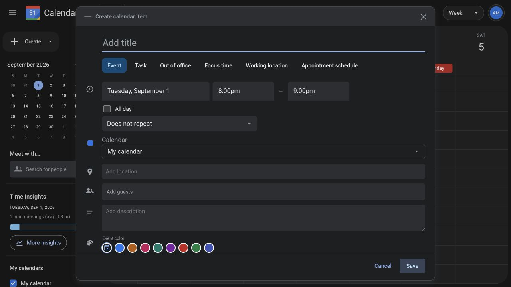

<h1 align="center">Calendar</h1>

<p align="center">
  A HackerRank sample repo for personal scheduling and team coordination.
</p>



## Built With

- [React 19](https://react.dev/) and [Vite 8](https://vite.dev/) for the frontend
- [Bun](https://bun.sh/) for workspace installation and JavaScript execution
- [Express 5](https://expressjs.com/) for the HTTP API
- [MongoDB](https://www.mongodb.com/) and [Mongoose](https://mongoosejs.com/) for persistence
- [Zod](https://zod.dev/) for request validation
- [JSON Web Tokens](https://jwt.io/) and [bcrypt](https://github.com/dcodeIO/bcrypt.js) for authentication

## Project Structure

```text
.
├── backend/                     # Express API, business logic, and MongoDB persistence
│   └── src/
│       ├── features/            # Product domains and API flows
│       ├── scripts/             # Deterministic seed data
│       └── shared/              # Configuration, authentication, and utilities
├── frontend/
│   ├── src/features/            # Product views and interactions
│   ├── src/shared/              # API client, reusable controls, and utilities
│   └── public/                  # Local static media
├── docs/                        # HackerRank Code Repo guidelines
├── .vscode/launch.json          # Backend debugger configuration
├── hackerrank.yml               # HackerRank install and run configuration
└── setup.sh                     # MongoDB readiness and seed reset
```

## Getting Started

### Prerequisites

- Bun 1.3 or later
- MongoDB 8.0 or later on `127.0.0.1:27017`

### Development Setup

1. Clone the repository.

   ```bash
   git clone https://github.com/ProblemSetters/coderepo-react-node-calendar.git
   ```

2. Open the project directory.

   ```bash
   cd coderepo-react-node-calendar
   ```

3. Install the pinned workspaces.

   ```bash
   bun install
   ```

4. Start the complete application.

   ```bash
   bun start
   ```

   Startup checks MongoDB, restores the seeded baseline, and launches the frontend and backend.

5. Open [http://localhost:3000](http://localhost:3000) and sign in.

   ```text
   Email: alex.morgan@calendar.com
   Password: password123
   ```

   Choose any seeded profile to enter the calendar workspace.

The frontend runs on port `3000`, the API runs on port `8000`, and health is available at [http://localhost:8000/api/v1/health](http://localhost:8000/api/v1/health).

### Commands

| Command | Purpose |
|---|---|
| `bun start` | Seeds MongoDB and starts the frontend and backend together. |
| `bun run seed` | Restores the deterministic MongoDB baseline. |
| `bun run dev:backend` | Starts only the Express API on port `8000`. |
| `bun run dev:frontend` | Starts only Vite on port `3000`. |

HackerRank installs the application with `bun install && bash setup.sh --seed` and runs it with `bun start`.

## Validate the Repository

Follow the [HackerRank Code Repo Guidelines](docs/HackerRank-Code-Repo-Guidelines.md) while creating the application to keep its structure, setup, and product behavior aligned.

The validation skill is not part of this repository. It ships with the assignment guidelines repo. Follow that repo's README to run it against this application.
