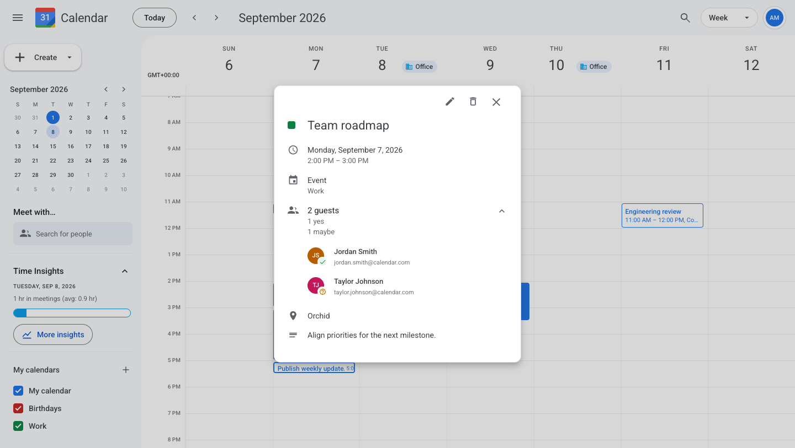
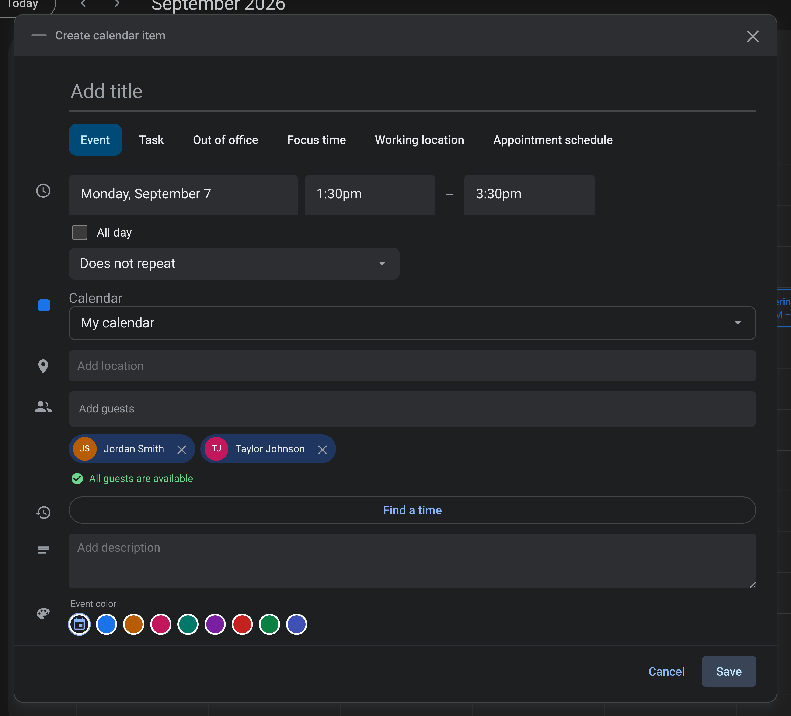
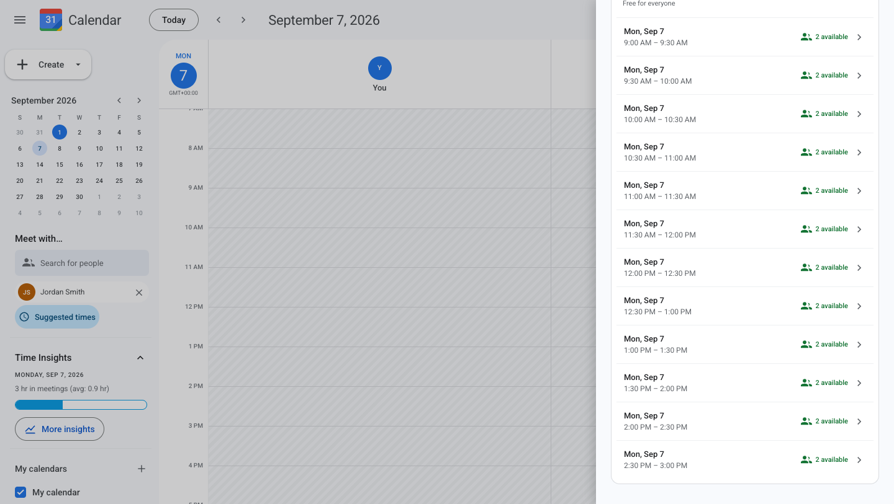
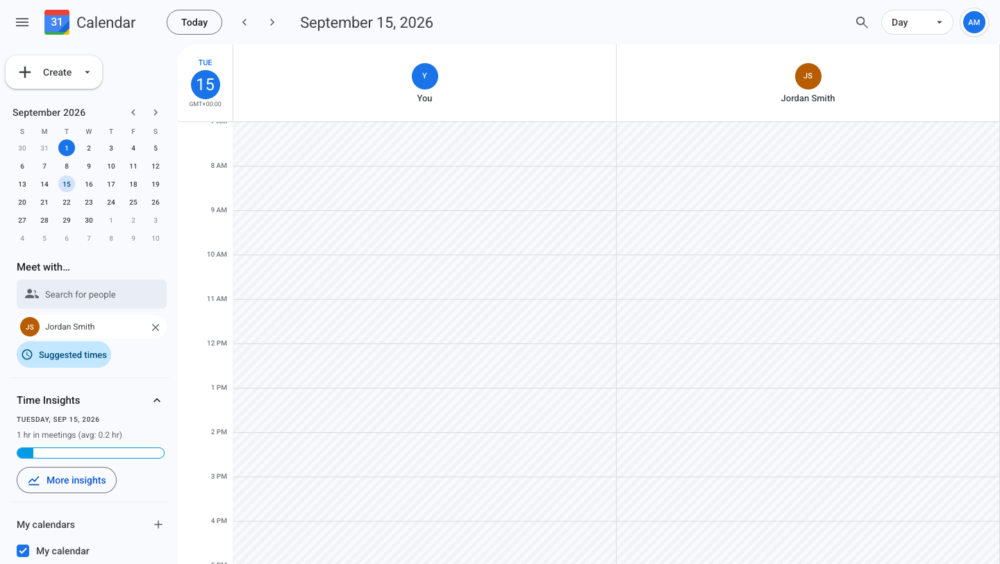
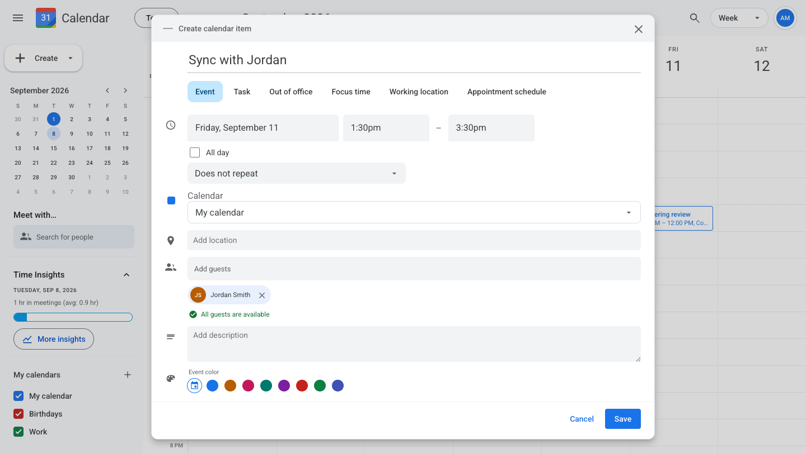

# Bug Fix: Meeting Conflicts

`Medium`

## Overview

**Skills:** Node.js (Intermediate), Scheduling Logic
**Recommended Duration:** 60 mins

This backend question evaluates Node.js, bug fixing, and date-range reasoning, and suits mid-level roles. The task is to repair the availability checks in a calendar app so that busy guests are actually reported as busy.

Calendar is a scheduling app where a team keeps their calendars and invites each other to meetings. While you pick a time, the event editor checks the guests you invited and warns you about anyone already busy, and Find a time proposes slots that clash with nobody. The availability layer behind both is returning wrong answers.

## Issue Summary

Several users report that the app tells them everyone is free when they are not.

- Guests who are already busy are shown as available. This covers a guest whose meeting falls inside the time being planned, a guest who has not answered an invitation or answered "Maybe", and a guest who is out of office all day.
- A repeating meeting only blocks its first week. Every week after that shows as free.
- Find a time suggests slots the organizer already has a meeting in.
- Reported busy blocks run past the window that was asked about, instead of being trimmed to it.

Your task is to fix the availability flow on the backend.

## Steps to Reproduce

- Sign in as **Alex Morgan**. Every demo user signs in with their own address and the same password.
  ```
  Email: alex.morgan@calendar.com
  Password: password123
  ```
- Find the **Team roadmap** event on the calendar. Its guest list shows one guest accepted and the other answered "Maybe", so both are busy for that hour. Note the day and time, then close the event.
  
- Click **Create** and choose **Event**. Put it on the same day, starting 30 minutes before Team roadmap and ending 30 minutes after it, then add the same two guests.
- Observe that the editor reports "All guests are available", although Team roadmap falls inside this window and neither guest declined it.
  
- Cancel that event. In the sidebar, add **Jordan Smith** under **Meet with**, then click **Suggested times**.
- Scroll the list of best available times. Observe that it offers **2:00 PM** and **2:30 PM** on the same Monday, although Alex Morgan already has Team roadmap then.
  
- With Jordan Smith still selected, move forward to a weekday about two weeks ahead. Her repeating meeting falls on that day, but her column is empty and no clash is reported.
  
- Create an event on the Friday **Jordan Smith** is out of office all day, and add her as a guest. Observe that she is reported as available.
  

## Expected Behavior

- A guest is busy when a meeting genuinely overlaps the proposed window, and overlap is judged on the whole window rather than only its start.
- A guest counts as busy unless they declined. Not answering and answering "Maybe" both still mean busy.
- An all-day out of office makes that guest busy for the day. Other all-day items, such as a working location, leave them free.
- Every occurrence of a repeating meeting blocks time, not only the first.
- Reported busy blocks are trimmed to the window that was asked about.
- Find a time never proposes a slot that clashes with the organizer or any guest, and never proposes one outside working hours.

**Note:** Review `technical-specs/MeetingConflicts.md` for the complete contract, including the busy rules and the request and response shapes for both availability endpoints.

**Note:** The acceptance criteria for this task require your solution to pass all predefined test cases. Use the failing tests to guide debugging.
